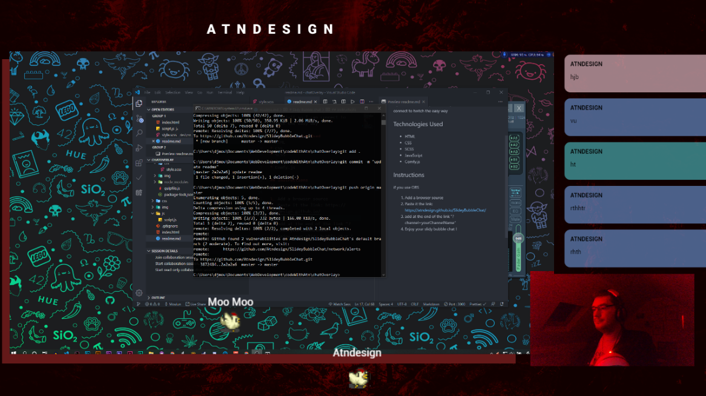

# Slidy Bubble chat

## Idea
The idea was that I wanted something for my upcoming streams, and I wanted to make the custom style, so I used comfy.JS made by Instafluff so I can connect to twitch the easy way 

SpankyG2: 
"You should use the color from each viewer", and so I did!

## Technologies Used
* HTML
* CSS
* SCSS
* JavaScript
* Comfy.js

## Instructions
if you use OBS

1. Add a browser source
2. Paste it the link: https://atndesign.github.io/SlideyBubbleChat/
3. add at the end of the link "?channel=yourChannelName"
4. Enjoy your slidy bubble chat ! 